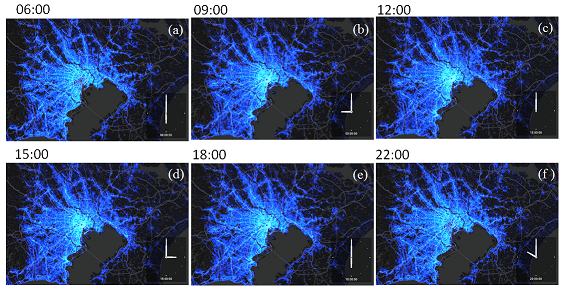
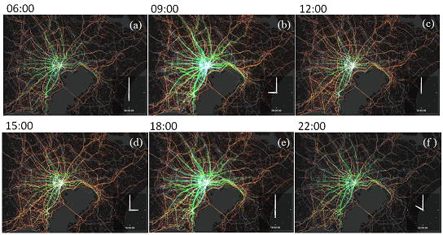

# Abstract
An open dataset for typical people mass movement in urban areas

# Format
+ id : unique agent id (int)
+ time : YYYY/MM/DD HH:mm:ss(char[])
+ longitude : SRID-4326(double)
+ latitude: SRID-4326(double)
+ transport: STAY-99, WALK-1, VEHICLE-2, TRAIN-3, BICYCLE-4(int)
+ magnification factor: (double)

# DataSet

# Visualization
### [movie1](movie/tokyo_point.mp4 "movie1")
People distribution visualized in a time series representation. Each dot represents a person.

### [movie2](movie/tokyo_tail.mp4 "movie2")
Trips visualized in a time series representation. Each line represents a trip, and each color represents a movement status (green: train, orange: vehicle). 

